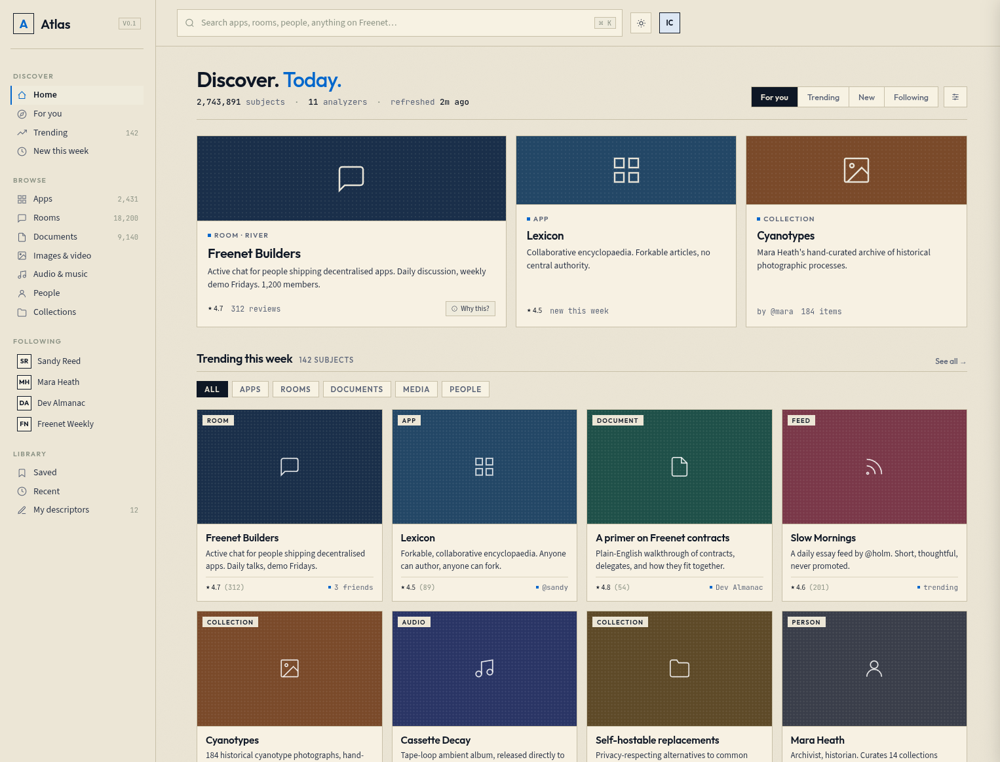

# Atlas

Atlas is a proposed **decentralized discovery layer for Freenet**: a way to
describe, index, search, recommend, review, and discover Freenet content and
applications without relying on a centralized search engine or recommendation
service.

Rather than imposing a single canonical index or ranking, Atlas provides a
framework for publishing signed metadata and building many competing,
pluralistic discovery systems on top of it. Users stay in control of which
analyzers, indexes, curators, and ranking policies they trust.

## UI mockup

The image below is an early **mockup** of the default Atlas browsing
experience, meant only to convey the intended feel: quick, friendly, and
immediately useful, with no setup or learning curve. It is a design sketch.
The UI has not been built yet, and the real thing will probably look quite
different.

## Status

Atlas is an early-stage, work-in-progress proposal. Goals, architecture,
descriptor schemas, and naming are all open for discussion and likely to
change.

See [PROPOSAL.md](PROPOSAL.md) for the full RFC.
