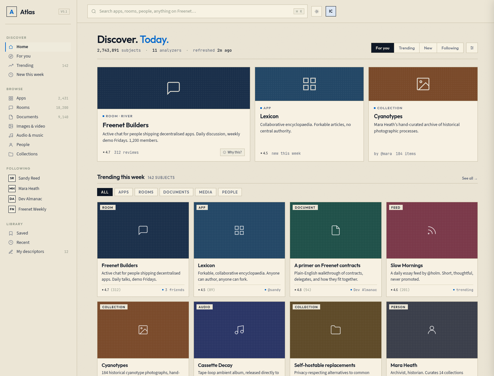

# Atlas

Atlas is a **decentralized discovery layer for Freenet**: a way to describe,
index, search, recommend, review, and discover Freenet content and
applications without relying on a centralized search engine or recommendation
service.

Rather than imposing a single canonical index or ranking, Atlas provides a
framework for publishing signed metadata and building many competing,
pluralistic discovery systems on top of it. Users stay in control of which
analyzers, indexes, curators, and ranking policies they trust.

**A first version is live on Freenet.** With a Freenet node running locally,
open Atlas at:

<http://127.0.0.1:7509/v1/contract/web/771DvtPMwt2PumPyrFvsz7fpvU1gogcmb5qtS1yYEEH9/>

## UI

The Atlas browsing experience: open it, search, and open what you find, with
no setup or learning curve. The screenshot below is the live UI. Its entries
are gathered automatically by a crawler that describes each resource with an
LLM.



## Publishing (curator)

The index contract's address is `hash(compiled_wasm, params)`, so **any change
under `common/` or `contracts/` re-keys the live index**. The UI has to be told
the new address, and the curated entries have to be carried across.

Getting the order wrong is silent, which is why it is written down. If the UI is
published without being rebuilt against the new index id, it keeps reading the
retired generation: the site renders the pre-re-key snapshot indefinitely and
simply stops showing new listings. Nothing errors. `ATLAS_INDEX_ID` is therefore
required at build time with no default, so a forgotten rebuild fails loudly
instead.

Run these **in order**. Steps 1-3 leave the UI reading the still-populated old
address, so there is no window where the site shows an empty index.

```bash
# 0. Sanity: what moved, and what is the new address?
atlasctl keys                    # current + every registered legacy generation

# 1. Carry the entries forward FIRST. This also performs the initial PUT that
#    creates the new address, so `atlasctl add` would fail before it.
atlasctl migrate --dry-run       # survey; reports per-generation contents
atlasctl migrate

# 2. Confirm what the new address now serves.
atlasctl show

# 3. Register any app-hosted containers (see "app registry" below).
atlasctl apps

# 4. Rebuild the UI against the NEW index id. There is deliberately no default, so
#    forgetting this fails the build instead of silently publishing a UI pinned to
#    the retired generation.
ATLAS_INDEX_ID=$(atlasctl key) dx build --release -p atlas-ui

# 5. Publish the web container (its address does NOT move; only its content).
atlasctl webapp-sign --archive webapp.tar.xz --version <n> --out-meta meta.cbor
atlasctl webapp-put --wasm <container.wasm> --archive webapp.tar.xz --metadata meta.cbor
```

When the rebuild changes the contract WASM, the **re-key ritual** is mandatory
and CI enforces it, in three parts, all in the same change:

1. Preserve the outgoing generation's WASM under `contracts/index-contract/legacy/`.
2. Prepend its code hash to `LEGACY_INDEX_CODE_HASHES` in `cli/src/migration.rs`.
3. **Re-sign the pointer record**: `./scripts/sign-pointer-records.sh`, then
   `./scripts/publish-pointer-records.sh` from `main` after the change merges.

Steps 1-2 carry OUR curated entries forward. Step 3 carries THIRD PARTIES
forward — the pointer record is what they resolve instead of pinning an id that
moves (see `FREENET.md`). Same trigger, different people, and the pointer
failure is the quieter of the two: a stale pointer answers confidently with a
dead id rather than erroring. CI's `pointer-freshness` job fails the build if
step 3 is skipped.

Skipping steps 1-2 orphans the curated entries at an address nothing probes.
Skipping step 3 strands anyone integrating with Atlas — which has already
happened once here: `PUBLISHING-KEYS.md` named an index id two re-keys stale,
and because both the stale and current ids answer a GET, a reader got a
plausible, smaller, frozen index and no error at all.

### App registry

Some Freenet content is not contract-addressed: every Delta site is served by the
*same* Delta web container, so it is identified by `(app, resource)` rather than
by a contract id. Those entries use an `app:<slug>/<resource>` locator and are
resolved through a root-signed registry in the index state:

```bash
atlasctl app-set --app delta --name Delta \
  --contract-id EqJ5YpEEV3XLqEvKWLQHFhGAac2qXzSUoE6k2zbdnXBr \
  --expect-version <current>     # ALWAYS required (use 0 for the first registry)
```

When an app republishes and its container address moves, re-point it with one
`app-set` and every entry for that app follows. Entries naming an app the
registry does not know are valid but render as "Unavailable" until it is
registered, so ordering between adding entries and registering an app does not
matter.

## Status

Atlas is early and evolving. The first version, a fast, populated, read-only
front door to Freenet, is live. The broader design (open descriptors and
reviews, publisher self-submission, and multiple competing indexes) is still
taking shape, so goals, architecture, schemas, and naming may still change.

See [PROPOSAL.md](PROPOSAL.md) for the full RFC.
